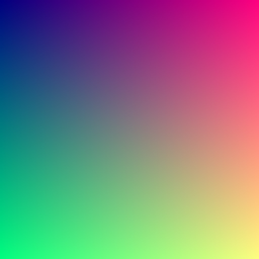
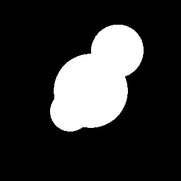
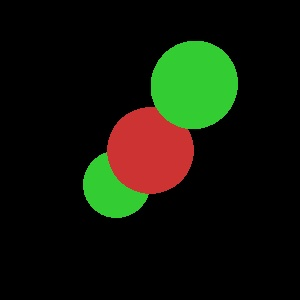
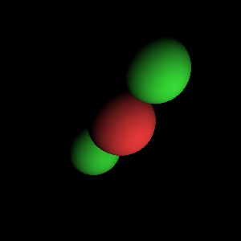
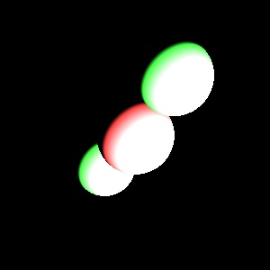
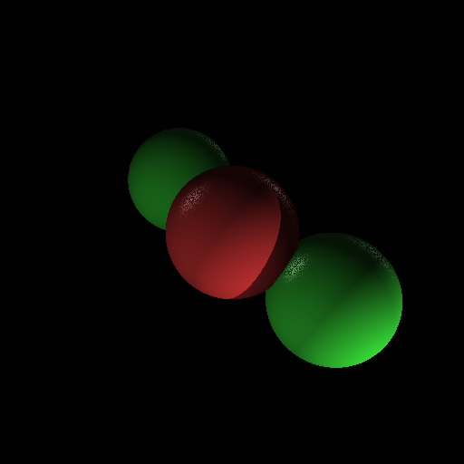
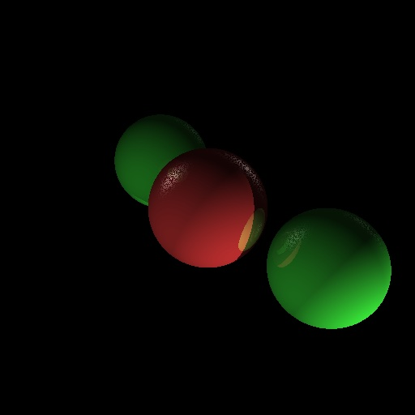
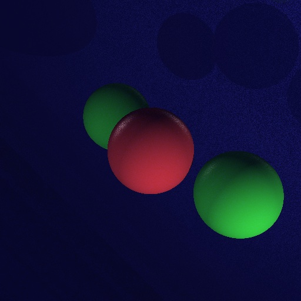
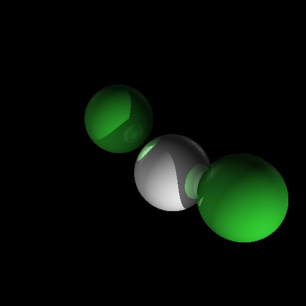

# Simple Ray Tracing

By Ilia Shevchenko

## Overview
This ray tracing application is a simple implementation that progressively evolves through various stages to achieve realistic rendering of 3D scenes. The program demonstrates key concepts in computer graphics, including intersection calculations, material properties, lighting, shadows, and recursive ray tracing.

## Getting Started
To compile and run the application, use the following commands:

```bash
make clean run
```

To test the application, execute:

```bash
make clean test
```

## Evolution of the Program

### 0) Gradient Testing
The initial stage involves testing the basic functionality of the `Image` class with gradient patterns.



### 1) Sphere Intersection Implementation
The program introduces the first implementation of sphere intersections to handle basic geometric shapes.



### 2) Sphere Material Implementation
Materials for spheres are implemented to simulate surface properties, adding realism to the rendered scenes.



### 3) Diffuse Lighting
The application incorporates diffuse lighting to simulate how surfaces interact with light, providing a more realistic appearance.



### 4) Intensity Clamping
To avoid unrealistic brightness, intensity clamping is introduced, ensuring that light intensities are within a reasonable range.



### 5) Specular Lighting (Phong Reflection Model)
Specular lighting is implemented using the Phong reflection model, enhancing the visual quality of reflective surfaces.


### 6) Shadows and Ambient Lighting
The program adds shadows, ambient lighting, and correct reflection from the nearest object, improving scene realism.



### 7) Recursive Ray Tracing
Recursive ray tracing is implemented to simulate reflections, refractions, and more complex lighting effects.



### 8) Additional Objects - Plane Class
The `Plane` and virtual `Object` class implemented, expanding the variety of objects that can be rendered in the scene.(Previous `Object` class renamed to `Sphere`)



### 9) Additional Objects -  Anti-Aliasing
The final evolution introduces anti-aliasing - rendering the scene multiple times to get smoother image.

